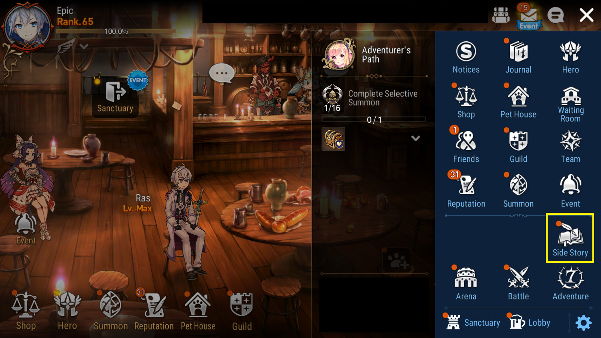
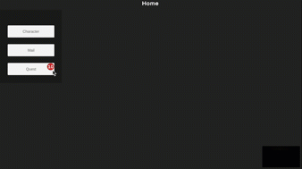
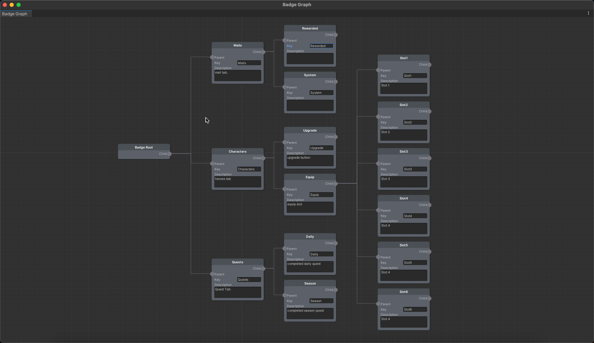

## Introduction

Dot Badge Notifications, also known as red dot notifications, are small icons, typically red, serving as indicators appearing on game UI elements. These simple visual alerts notify users about new content, messages, or events designed to draw the player's attention. By doing so, they play a crucial role in increasing user engagement and retention in games.


This package allows you to create dot badge notifications for all games developed on Unity. Sample usage of the package can be found in [Sample](https://github.com/felixngd/BadgeNotification/tree/master/Assets/BadgeNotification)

## Test Status

Most of my test cases have passed, ensuring the reliability and robustness of my package. I am continuously working on improving and expanding my test coverage.
## Installation

### Dependencies

- [UniTask](https://github.com/Cysharp/UniTask) 2.5.1 or newer.
- [XNode](https://github.com/Siccity/xNode) 1.8.0 or newer.
- [MessagePipe](https://github.com/Cysharp/MessagePipe) 1.7.4 or newer (you may replace it with another Pub/Sub library).

### Installation Methods

**Method 1 Using Package Manager** 

1. Open Package Manager from `Window > Package Manager`.
2. Click the "+" button > `Add package from git URL`.
3. Enter the following URL:
   `https://github.com/felixngd/BadgeNotification.git?path=Packages/BadgeNotification`

**Method 2** Modify `Packages/manifest.json`

Add the following to the dependencies block:

```json
{
 "dependencies": {
     "com.voidex.badgenotification": "https://github.com/felixngd/BadgeNotification.git#0.2.0"
 }
}
```
## Getting Started

### Building a Badge Notification instance
The Badge Notification system is constructed using a Trie, a tree-like data structure that stores key-value pairs. In this context, the keys represent the paths from the root to a specific node, while the values correspond to the badge counts and a custom value.

The paths example:
```plaintext
Root
Root|Mails
Root|Mails|Rewarded
Root|Mails|System
Root|Characters
Root|Characters|0
Root|Characters|0|Equip|Sword
Root|Characters|0|Equip|Shield
...
```
There are two ways to build up the Trie in the Badge Notification:
* **Using the Badge Graph**
* **Building a custom Trie**

#### Using the Badge Graph

You can use the Badge Graph to represent the hierarchy of badges in a graph format. To use Badge Graph, you need to install the XNode package and add the symbol `USE_XNODE` to the Scripting Define Symbols in the Player Settings.

To create a Badge Graph, right-click in the directory where you want to store the graph (.asset) file. Select `Create > BadgeNotification > Graph`. Double-click on the newly created file to open the Badge Graph design interface.


Designing the Badge Graph

First, you need to create a Badge Root node, right-click in an empty area on the Badge Graph window and select `Voidex > Badge > Runtime > Badge Root`.

Create child nodes similarly by selecting `Voidex > Badge > Runtime > Badge`. Enter a key and description for the nodes you create. 

> **Note:** the key is used for manipulation at runtime, and the description is for easier reading of the graph.

Use Badge Graph in code:
```csharp
   void InitBadgeNotification(Voidex.Badge.Runtime.BadgeGraph badgeGraph)
   {
        BadgeNotification = new BadgeNotification(badgeGraph);
   }
```

#### Building a custom Trie
```csharp
public class BadgeNotification : BadgeNotificationBase<int>
    {
        // Inherits BadgeNotificationBase and write your own custom constructor to build the Trie
        public BadgeNotification(List<string> list) : base()
        {
            _trieMap = new TrieMap<BadgeData<int>>();
            foreach (var key in list)
            {
                var value = new BadgeData<int>
                {
                    badgeCount = 0,
                    value = default, nodeType = default
                };
                _trieMap.Add(key, value);
                BadgeMessaging<int>.UpdateBadge(key, value);
            }
        }
    }
```

## Initialization

Badge Notification works based on the Pub/Sub model, with the state of each dot badge on the UI depending on the BadgeChangedMessage it receives. The system uses the `IPubSub<TMessage>` interface to send and receive these messages. Check the example below to see how to implement the interface using MessagePipe.

**Creating a class that implements BadgeNotificationBase**

You can add more functionality to the BadgeNotification class by inheriting from BadgeNotificationBase. This class is a generic class that takes a BadgeValue type as a parameter. The BadgeValue type is a struct that contains the badge's key and value. You can create a custom BadgeValue type to store additional information about the badge.

```csharp
    public class BadgeNotification : BadgeNotificationBase<BadgeValue>
    {
        public BadgeNotification(BadgeGraph badgeGraph) : base(badgeGraph)
        {
        }
    }
```

**Using MessagePipe**

```csharp
public class MessagePipeMessaging : IPubSub<BadgeChangedMessage<BadgeValue>>
    {
        public readonly IPublisher<string, BadgeChangedMessage<BadgeValue>> _publisher;
        public readonly ISubscriber<string, BadgeChangedMessage<BadgeValue>> _subscriber;
        public MessagePipeMessaging()
        {
            var builder = new BuiltinContainerBuilder();
            builder.AddMessagePipe(o => o.EnableCaptureStackTrace = true);
            builder.AddMessageBroker<string, BadgeChangedMessage<BadgeValue>>();

            var provider = builder.BuildServiceProvider();
            GlobalMessagePipe.SetProvider(provider);

            _publisher = GlobalMessagePipe.GetPublisher<string, BadgeChangedMessage<BadgeValue>>();
            _subscriber = GlobalMessagePipe.GetSubscriber<string, BadgeChangedMessage<BadgeValue>>();
        }
        
        public void Publish(BadgeChangedMessage<BadgeValue> topic)
        {
            _publisher.Publish(topic.key, topic);
        }

        public IDisposable Subscribe(string key, Action<BadgeChangedMessage<BadgeValue>> callback)
        {
            return _subscriber.Subscribe(key, callback);
        }
    }
```
Note that it must be initialized first for the system to operate.
```csharp
IPubSub<BadgeChangedMessage<BadgeValue>> pubSub = new MessagePipeMessaging();
BadgeMessaging<BadgeValue>.Initialize(pubSub);
```
Next, initialize the Badge Notification service.
```cs
_badgeNotification = new BadgeNotification(badgeGraph);
```
### Displaying dot badge on UI
The package does not specifically implement on any UI system, so you can implement using your UI system. These UI elements need to register to receive BadgeChangedMessage to display.
```cs
 var messagePipe = SampleBadgeMessaging.GetMessagingService<MessagePipeMessaging>();
 _disposable = messagePipe.Subscribe(key, OnBadgeChanged, new ChangedValueFilter<BadgeChangedMessage<BadgeValue>>());
```
See the example of implementing a badge item on the UI below: 
* [DynamicBadgeItem](https://github.com/felixngd/BadgeNotification/blob/master/Assets/BadgeNotification/Scripts/Concretes/DynamicBadgeItem.cs) 
* [SimpleBadgeItem](https://github.com/felixngd/BadgeNotification/blob/master/Assets/BadgeNotification/Scripts/Concretes/SimpleBadgeItem.cs) 
* [TextBadgeItem](https://github.com/felixngd/BadgeNotification/blob/master/Assets/BadgeNotification/Scripts/Concretes/TextBadgeItem.cs)

## Updating BadgeNotification at runtime
### Adding new badge node
You can add a new dot badge (a node) in runtime, this method is very effective in the case of features with items dynamically instantiated in runtime that are not statically designed in the Badge Graph.
```cs
_badgeNotification.AddBadge(key, 1);
```
### Updating the value of a node
Updating the value of a node also simultaneously notifies the parent nodes of the change.
```cs
_badgeNotification.UpdateBadge("Root|Mails|Rewarded", -1);
```
### Retrieving value
```cs
var badge = badgeNotification.GetBadge("Root|Mails|Rewarded");
```
## Technical Explanation

### Trie Data Structure

The Badge Notification system uses a Trie (also known as a prefix tree) data structure to manage the badge nodes. A Trie is a tree-like data structure that is used to store a dynamic set or associative array where the keys are usually strings.

In the context of the Badge Notification system, each node in the Trie represents a badge. The path from root to a node is the badge's identifier, and the value is the badge's count. The root of the Trie represents the root badge, and each path from the root to a node represents the hierarchy of badges.

This structure allows efficient lookup, addition, and update of badges. It also allows efficient computation of aggregate badge counts (i.e., the total count of a badge and all its descendants), which is useful for displaying badge counts on parent UI elements that should show the total count of all their child elements.

### Publish/Subscribe Pattern

The Badge Notification system uses the Publish/Subscribe (Pub/Sub) pattern for notifying the UI about changes in badge counts. In this pattern, publishers (in this case, the Badge Notification system) send messages without knowing who the subscribers (the UI elements) are. Similarly, subscribers listen for specific messages without knowing who the publishers are.

When a badge's count changes, the Badge Notification system publishes a `BadgeChangedMessage`. UI elements that display that badge subscribe to `BadgeChangedMessage`s for that badge's key. When they receive a `BadgeChangedMessage`, they update their display to reflect the new badge count.

This decoupling of publishers and subscribers allows for flexibility and scalability. New UI elements can be added, or existing ones can be removed, without needing to change the Badge Notification system's code. Similarly, the Badge Notification system can change how and when it publishes messages without needing to change the UI code.
## License
[MIT License](https://github.com/felixngd/BadgeNotification/blob/master/LICENSE)
